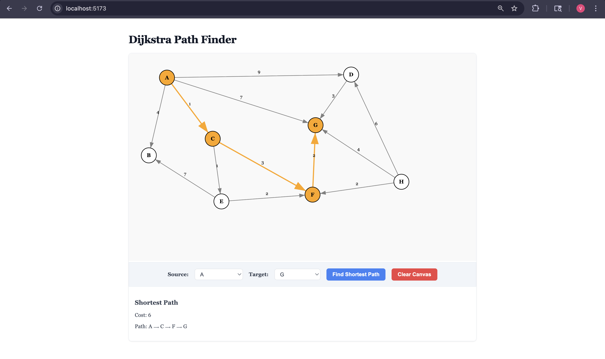

# Dijkstra Path Finder

A full-stack shortest path visualizer built to demonstrate DSA competency along with systems design across three languages - C++, Python and Javascript.



## Architecture

The shortest path algorithm is implemented in C++ and compiled into a shared library using pybind11. FastAPI exposes it as a REST endpoint. React renders an interactive graph interface where users can render weighted graphs and visualize the shortest path.

## Tech Stack

| Layer | Technology | Why |
|---|---|---|
| Algorithm | C++17 | Performance, demonstrates low-level DSA |
| Language bridge | pybind11 | Exposes C++ to Python without overhead |
| Build system | CMake | Industry standard for C++ projects |
| Backend | FastAPI | Lightweight, async, automatic validation |
| Frontend | React + Vite | Component-based, fast dev experience |
| Styling | CSS Modules | Scoped styles, no framework overhead |

## Features
- Interactive graph canvas: click to place nodes, click two nodes to draw a directed weighted edge
- Shortest path highlighted in orange on the canvas
- Path and total cost displayed below the canvas
- Clear canvas to start over

## Steps to Run locally

### Prerequisites
- Python 3.11+
- Node.js 18+
- CMake
- pybind11 (`pip install pybind11`)

### Backend

```bash
cd backend
mkdir build && cd build
cmake .. -DCMAKE_PREFIX_PATH=$(python3 -c "import pybind11; print(pybind11.get_cmake_dir())")
cmake --build . --config Release
cd ..
pip install -r requirements.txt
uvicorn main:app --reload
```

### Frontend

```bash
cd frontend
npm install
npm run dev
```

Open `http://localhost:5173` in Chrome.


## Future Improvements

- MongoDB integration to store and load pre-built graph templates
- Integration with a graph dataset API to lead real world graphs